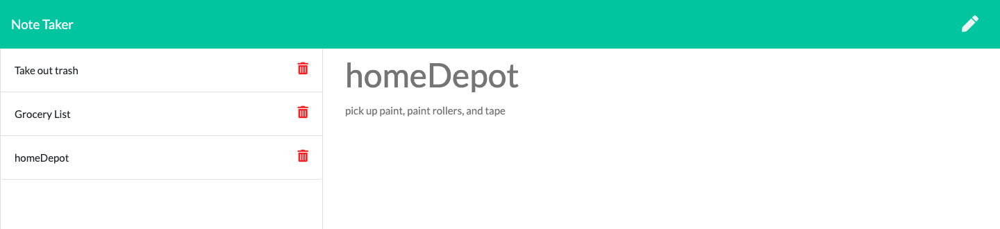

# Note Taker App

## Description

This project was built in order to easily enter notes, read them later and then delete them whenever you want.

## Table of Contents

- [Installation](#Installation)
- [Usage](#Usage)
- [License](#License)
- [Tests](#Tests)
- [Questions](#Questions)

## Installation

In order to run the program, you'll first have to fork the repo. To install all dependencies, in the terminal you'll need run

    npm install

## Usage

While in the project's root folder, in the terminal, to start the server,you'll enter

    node server.js

Next you'll navigate to localhost:3000 in your browser.

[Follow this link](https://git.heroku.com/pure-everglades-12320.git) for a live link which is hosted by Heroku.

## License

None

## Badges

## Tests

none

## Questions

If you have any questions, reach out to me through my [Github](www.github.com/levickane).
